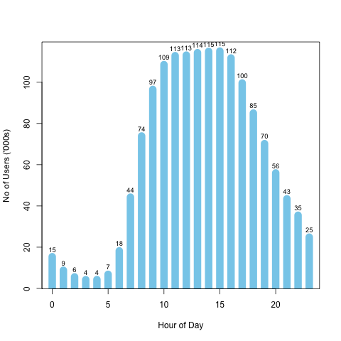
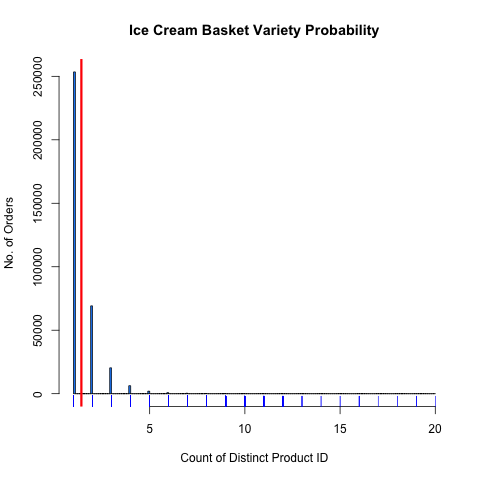
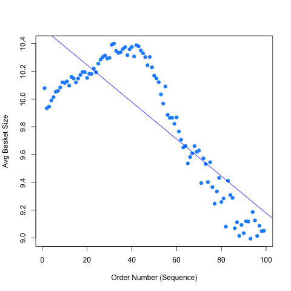

##### modified date: July 23, 2017

INS0923920381WD202C

Instacart Analysis is derived from the R scripts in the insta_public_analysis project. See end of file for license details.

```{r, echo=FALSE}
#source(file.path(getwd(),paste("Run_InstacartSourceFiles",".R",sep = "")), verbose = FALSE)
```


The sample of Instacart Data contains aggregate transactions of `r paste(userCounts[1])` and  `r paste(userCounts[2])` unique users that are part of the "prior" eval_set. 

The summary below represents the frequency distribution of the number of orders per user.
```{r, echo=FALSE}
frqSummary()
```


#### Users and Day of Week 

Sunday was the most popular day to place orders at `r paste(dow_userFunc()[which(dow_userFunc()[1] == 1),2])`.
Friday was the lease popular day to place orders at `r paste(dow_userFunc()[which(dow_userFunc()[1] == 6),2])`.

## Day and Hour Shopping {.tabset .tabset-fade .tabset-pills}
### Day of Week Shopping
The full distribution is available below as a data table and graph:
```{r,echo=FALSE}
rmarkdown::paged_table(dow_userFunc())
```


### Hour of Day Shopping
The hour of the day that was most shopped was hour 15 with a log10 total of 5.06 Orders and ranges from 10 -15 around 5 total orders.

The chart belows plots the points of total orders at the respective hours placed


### Day Of Week Ice Cream 
This graph represents day of week orders for Ice Cream Aisle. Product Names are different within the aisle.


### Hour of Day Ice Cream
This graph represents day of week orders for Ice Cream Aisle. Product Names are different within the aisle.


##

We see the pattern from the graph above, for the entire week. The following graph shows the averages for every hour for each day and groups by shopper type:


## Re Orders {.tabset .tabset-fade .tabset-pills}

### Days since prior order- Ice Cream
``` {r, echo = FALSE}
reorder_days(department = "frozen", aisle = "ice cream ice")
```

### How Many prior orders - Ice Cream

##


## Orders and Basket Size {.tabset .tabset-fade .tabset-pills}
### Basket Variety - Product Combinations
The graph shows the variety of the basket. The unique products in a basket decreases through the customers lifecyle. 
Note that there is one order_id outlier that has 145 unqiue product_ids in the order. 

Another interesting point; there seems to be a strong positive correlation in the quantity of unique products to the quantity of prior reorders (see How Many prior orders chart above) . So not only does the product basket variety decrease, but so does the number of future orders. 

This might show potential symptoms that a customer might "churn out" if the quantity of unique products decreases. We would need to perform a deeper analysis and hypothesis test to rule out other factors such as; seasonality, duration of products, etc. 

The outlier can be seen in the following distribution:


The users purchased a combination of 10 product_ids. However, a large proportion spans between 5 and 8 unique products, but are most frequently had 1  unique product at `r paste(length(unlist(a[which(a$no_products == 1),])))` orders. `r paste(length(unlist(a[which(a$no_products <= 8 | a$no_products >1 ),])))` orders were the denser proportion of orders. 

```{r, echo=FALSE}
summary(a$no_products)
``` 
```{r, echo=FALSE}
rmarkdown::paged_table(NoOrder_DeptAisle)
#tables::as.tabular((NoOrder_DeptAisle))
```


### Basket Size - Ice Cream
A basket that includes ice cream is likely to have around 1 or 2 different product id's:



### Reorders and Proportions - Ice Cream Only

Purchase frequency and most often reordered

``` {r include = TRUE, echo = FALSE}
# source https://www.kaggle.com/philippsp/exploratory-analysis-instacart/notebook  under Apache License
order_prod_prior_dept[which(order_prod_prior_dept$department == "frozen" & order_prod_prior_dept$aisle == "ice cream ice"),]  %>% 
  group_by(reordered) %>% 
  summarize(count = n()) %>% 
  mutate(reordered = as.factor(reordered)) %>%
  mutate(proportion = round((count/sum(count)),2))

```


### Reordered Proportion
``` {r include = TRUE, echo = FALSE}
rmarkdown::paged_table(reorderedProportion())
```

### Top Proportion Reordered

``` {r onclude = TRUE, echo = FALSE}
rmarkdown::paged_table(oftenOrderFun(topNProd = 100))
```


``` {r include = TRUE, echo = FALSE}
PlotoftenOrderFun(topNPrdPlot = 20)

```


##


## Basket Size Trend {.tabset .tabset-fade .tabset-pills}
### Basket Size Trend
The scatterplot shows an increase in product variety in each order from the first to the 30th order. Then the curve of the trend shifts downward after the 30th order.



`r rmarkdown::paged_table(basketsize_trend)`

### Basket Size Variance

This plot suggests that the customers are likely to have an average of approx. 9.4 items before their first 50 orders. 
After 50, the variance is wider, yet the customers basket size declines.


### Ice Cream Basket Trend
This graph suggests that when compared to the total average basket trend, the average of ice cream is a part of the basket anywhere between the first and 90th order and will have 1.6 to 2.0 types of ice cream. It does decrease , but since you cannot have partial ice cream product, it is most likely 2 different product ids.


### Ice Cream basket Variance
This graph suggests 2 different types of ice cream products within first 20 orders; variance will increase by up to 6 percent, but still not significant from the fitted line.


##


```{r, echo=FALSE}
# hold for path most travelled department --- aisles
```

\newpage

## Top Selling Products {.tabset .tabset-fade .tabset-pills}


The table below shows the top product names. 

### All Dept & Aisle

This treemap covers all departments and aisles.


This table shows top products:
```{r, echo=FALSE}
rmarkdown::paged_table(top_products(topN = 40))
```

### Frozen & Ice Cream 
Barplot of the top selling Ice Cream Products.


Table showing the to Ice Cream Products:


```{r, echo=FALSE}
rmarkdown::paged_table(top_products(department = "frozen", aisle = "ice cream ice", topN = 15))
```


## 

\pagebreak

##### Data Source:
The Instacart Online Grocery Shopping Dataset 2017”, Accessed from https://www.instacart.com/datasets/grocery-shopping-2017 on July 2017

###### This project was developed on R System for Statistical Computation and Graphics. All source code is in R Programming Language. For information see https://www.r-project.org/about.html

##### License and Copyright
     Project: insta_public_analysis project
     Copyright(C) Michael Garcia 2017. All Rights Reserved.
     GNU General Public License Version 3
     Contact Author: mgar_datascience at protonmail dot com     
                                                                                 
     This program is distributed in the hope that it will be useful,             
     but WITHOUT ANY WARRANTY; without even the implied warranty of              
     MERCHANTABILITY or FITNESS FOR A PARTICULAR PURPOSE.  See the               
     GNU General Public License Version 3 for more details.                      
     See http://www.gnu.org/licenses for full license. Additional Licenses 
     may apply. Run source(listPckg) for a list of installed packages and
     licenses.
##### Also Contains Source from: 
     Philipp Spachtholz as permitted by Apache 2.0 License 
     http://www.apache.org/licenses/LICENSE-2.0
     Repository
     https://www.kaggle.com/philippsp/exploratory-analysis-instacart/code

