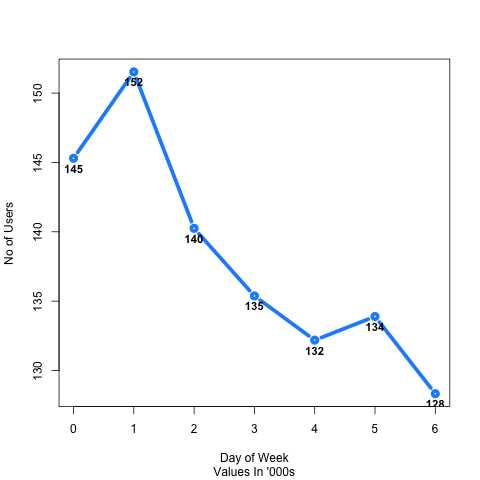

####Source for all Data:
"The Instacart Online Grocery Shopping Dataset 2017”, Accessed from https://www.instacart.com/datasets/grocery-shopping-2017 on July 2017"


Instacart Analysis is derived from the R scripts in the insta_public_analysis project. See end of file for license details.


The sample of Instacart Data contains aggregate transactions of `r paste(userCounts()[1])` and  `r paste(userCounts()[2])` unique users that are part of the "prior" eval_set. 

The summary below represents the frequency distribution of the number of orders per user.
```{r, echo=FALSE}
frqSummary()
```


#### Users and Day of Week 

Sunday was the most popular day to place orders at `r paste(dow_userFunc()[which(dow_userFunc()[1] == 1),2])`.
Friday was the lease popular day to place orders at `r paste(dow_userFunc()[which(dow_userFunc()[1] == 6),2])`.


The full distribution is available below as a data table and graph:
```{r,echo=FALSE}
dow_userFunc()
```



#### Time of Day Shopping
The hour of the day that was most shopped was hour 15 with a log10 total of 5.06 Orders and ranges from 10 -15 around 5 total orders.

The chart belows plots the points of total orders at the respective hours placed


##### Orders and Product Id Variety
The density displays the number of different product combinations per order. Note that there is one order_id outlier that
has 145 unqiue product_ids in the order.

The outlier can be seen in the following distribution:


The users purchased a combination of 10 product_ids. However, a large proportion spans between 5 and 8 unique products, but are most frequently had 1  unique product at `r paste(length(unlist(a[which(a$no_products == 1),])))` orders. `r paste(length(unlist(a[which(a$no_products <= 8 | a$no_products >1 ),])))` orders were the denser proportion of orders. 

```{r}
summary(a$no_products)
``` 

####Source for all Data:
"The Instacart Online Grocery Shopping Dataset 2017”, Accessed from https://www.instacart.com/datasets/grocery-shopping-2017 on July 2017"

     Project: insta_public_analysis project
     Copyright(C) Michael Garcia 2017. All Rights Reserved.
     GNU General Public License Version 3
     Contact Author: mgar_datascience at protonmail dot com     
                                                                                 
     This program is distributed in the hope that it will be useful,             
     but WITHOUT ANY WARRANTY; without even the implied warranty of              
     MERCHANTABILITY or FITNESS FOR A PARTICULAR PURPOSE.  See the               
     GNU General Public License Version 3 for more details.                      
     See http://www.gnu.org/licenses for full license. Additional Licenses 
     may apply. Run source(listPckg) for a list of installed packages and
     licenses.


